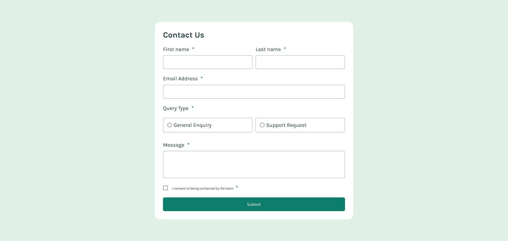
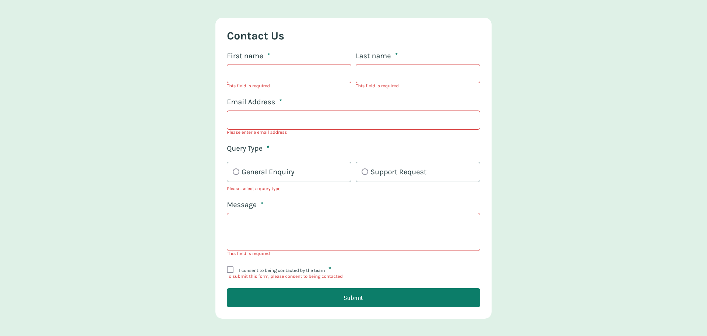
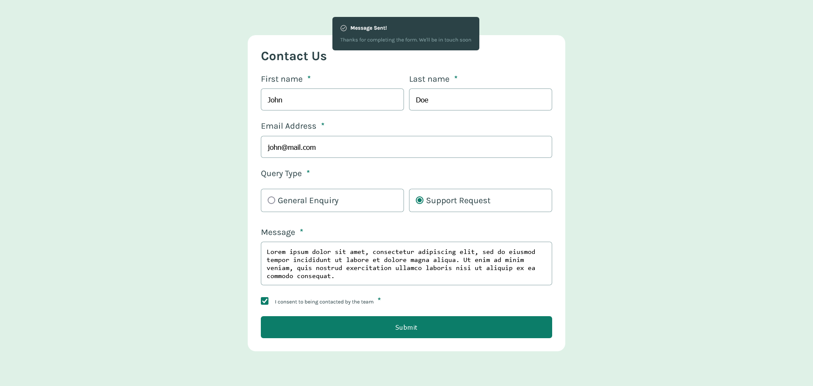
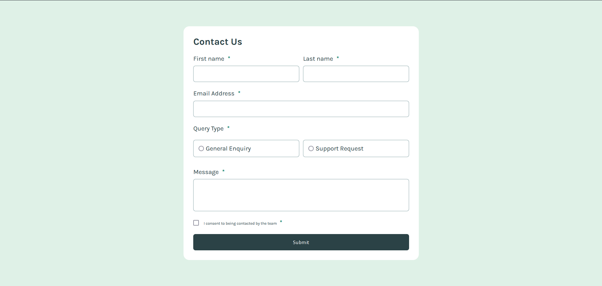
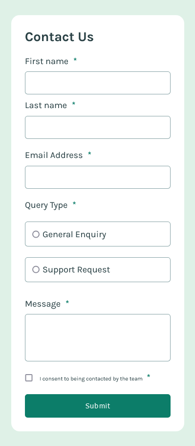

# Frontend Mentor - Contact form solution

This is a solution to the [Contact form challenge on Frontend Mentor](https://www.frontendmentor.io/challenges/contact-form--G-hYlqKJj).

## Overview

### The challenge

Users should be able to:

- Complete the form and see a success toast message upon successful submission

- Receive form validation messages if:

- A required field has been missed

- The email address is not formatted correctly

- Complete the form only using their keyboard

- Have inputs, error messages, and the success message announced on their screen reader

- View the optimal layout for the interface depending on their device's screen size

- See hover and focus states for all interactive elements on the page

### Screenshot

### Links

- Solution URL: [Frontend Mentor](https://www.frontendmentor.io/challenges/contact-form--G-hYlqKJj/hub)

- Live Site URL: [Netlify](https://contact-form-2024.netlify.app/)

## My process

### Built with

- Semantic HTML5 markup

- CSS custom properties

- Flexbox

- JavaScript Vanilla
  
## Author

- Frontend Mentor - [@iEerii](https://www.frontendmentor.io/profile/iEerii)

- GitHub - [@iEerii](https://github.com/iEerii)

## Acknowledgments

- GitHub - [@JesusEmmanuelPonce](https://github.com/JesusEmmanuelPonce)